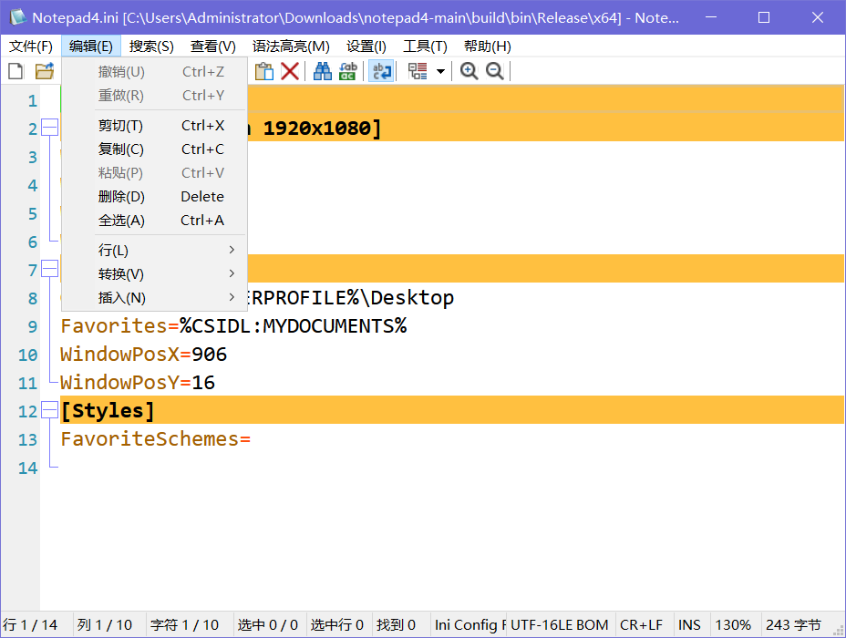
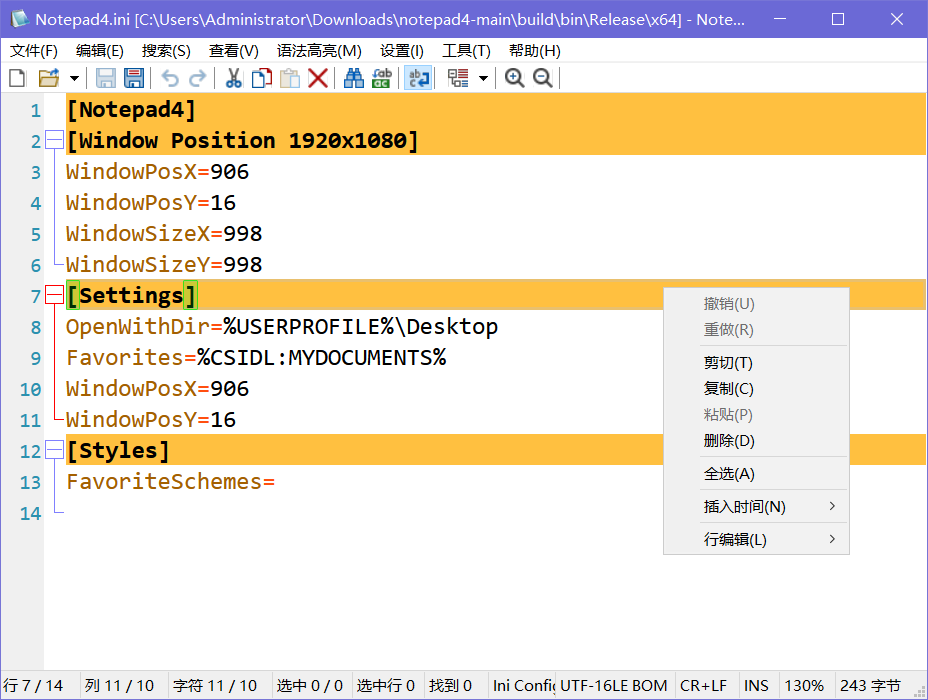

**已修改为中文界面。还有一些设置隐藏菜单了以更适合我自已使用。**

# 1 \src\Notepad4.rc
 - 只是注释了里面的用不到的菜单
 - 修改了Notepad4.rc显示的菜单上的某些菜单隐藏起来了，代码没有删除了.

# 2 \src\Notepad4.cpp 第70行左右。
- 还有修改工具栏的排列显示了，使工具栏更适合我自已的使用了。
- //#define DefaultToolbarButtons L"22 3 0 1 27 2 0 4 18 19 0 5 6 0 7 8 9 20 0 10 11 0 12 0 24 0 13 14 0 15 16 0 17"
- #define DefaultToolbarButtons L"1 2 0 4 18 0 5 6 0 7 8 9 20 0 10 11 0 12 0 24 0 13 14 0"

# 3 \src\EditLexers\stlCPP.cpp
- cpp 的注释字体的颜色因为偏灰色，不习惯，于是修改为绿色了。
- //{ MULTI_STYLE(SCE_C_COMMENT, SCE_C_COMMENTLINE, 0, 0), NP2StyleX_Comment, L"fore:#608060" },
- { MULTI_STYLE(SCE_C_COMMENT, SCE_C_COMMENTLINE, 0, 0), NP2StyleX_Comment, L"fore:#008000" },

# 4 修改了右键菜单显示，添加了插入时间和行编辑 两项。

# 5 在右键上添加了像EDITPLUS一样的块操作，也是列操作了。按住ALT后可以框住想框的内容，然后对这个列块进行左移和右移， 同时也可以对整个列块前面或者后面进行插入内容。当然这代码是AI写的了。
	 
 

